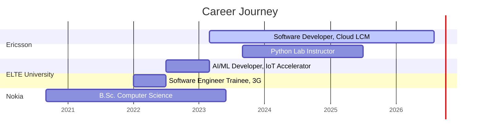

<div align="center">

<!-- Header Banner -->


<!-- Typing Animation -->


<br/>

<!-- Social Badges -->
[](https://amhkhowaja.github.io)
[](https://archloop.io)
[](https://linkedin.com/in/aadarsh-mehdi-73754b13b)
[](mailto:aadarshofficial110@gmail.com)

</div>

---


### About Me

    

<br/>

| | |
|---|---|
| **Role** | Experienced Software Developer, Cloud LCM Microservices |
| **Company** |  Ericsson Hungary (Mar 2023 - Present) |
| **Education** |  B.Sc. Computer Science, Budapest (2020-2023) |
| **Thesis** | *"Adaptive, Context-Aware AI Conversational Agent for IoT"* |
| **Teaching** |  ELTE (Sep 2023 - Jul 2025), 100+ students |
| **Building** | <a href="https://archloop.io"></a> AI-powered project management SaaS |
| **Work Auth** | Permanent Residence, no sponsorship needed |

<br/>

> *Software Developer with 4+ years of experience designing, owning, and operating cloud-native microservices in telecom-scale production environments. End-to-end ownership from API design through Kubernetes deployment. Hands-on with GenAI, RAG pipelines, multi-agent systems and LLM evaluation.*

<br clear="right"/>

---

### What I'm Working On

<table>
<tr>
<td width="50%" valign="top">

####  @ 
- Designing & operating **10+ microservices** on Kubernetes
- End-to-end ownership: API > tests > containers > prod
- Engineered **zero-data-loss migrations** (etcd > OpenSearch)
- Built shared libraries (auth, object_storage, search_engine)
- Reduced CI/CD test execution time by **40%**

</td>
<td width="50%" valign="top">

#### 
- **Archloop.io** : AI project management SaaS
- Multi-agent orchestration with LangGraph & CrewAI
- RAG pipelines & LLM evaluation (DeepEval)
- Self-optimizing prompt systems (AI Auto Improver)
- Previously: RASA Digital Assistant exhibited to customers

</td>
</tr>
</table>

---

### Tech Arsenal

<div align="center">

<!-- Languages -->


<br/><br/>

<!-- Cloud & Infra -->


<br/><br/>

<!-- Frameworks -->


<br/><br/>

<!-- Data & Tools -->


</div>

<details>
<summary><b>Full Skills Breakdown (click to expand)</b></summary>
<br/>

| Category | Technologies |
|----------|-------------|
| **Languages** | Python, Go, Java, Kotlin, C++, JavaScript, TypeScript, Bash, PowerShell |
| **Backend & Distributed** | Microservices, REST APIs, Event-Driven Architecture, Spring Boot, Kafka, RabbitMQ, OpenAPI |
| **Cloud & DevOps** | AWS (EC2, EKS, IAM, S3, Lambda, CloudWatch, SQS), GCP (GKE), Terraform, Kubernetes, Docker, Helm, Jenkins, Airflow, CI/CD |
| **AI / ML / GenAI** | LangChain, LangFlow, LangGraph, CrewAI, Instructor, LiteLLM, DeepEval, TensorFlow, Keras, RASA, RAG, Multi-Agent Orchestration |
| **Databases** | PostgreSQL, MongoDB, Redis, InfluxDB, ETCD, OpenSearch |
| **Observability & Security** | Prometheus, Grafana, VictoriaMetrics, OAuth 2.0, RBAC, Keycloak, SCA, SonarQube |
| **Frontend** | React, Streamlit, Gradio, HTML, CSS, Bootstrap |
| **Testing** | Robot Framework, Selenium, pytest, JUnit, testify (Go) |
| **Collaboration** | Git, GitHub, GitLab, Gerrit, Jira, Confluence |

</details>

---

### GitHub Stats

<div align="center">


</div>

<br/>

<div align="center">

</div>

---

### Featured Projects

<div align="center">

[](https://archloop.io)

</div>

<br/>

<div align="center">
<table>
<tr>
<td align="center" width="50%">

<a href="https://archloop.io">
<br/>
<b>Archloop.io</b>
</a>
<br/><br/>
AI-powered SaaS for project management.<br/>
Multi-tenant, Jira/GitHub/GitLab integration,<br/>
agentic AI orchestration with failure recovery.
<br/><br/>

<br/>
<sub>FastAPI, React, Keycloak, LangChain, Temporal, Stripe, Supabase</sub>

</td>
<td align="center" width="50%">

<a href="https://github.com/amhkhowaja/ai-auto-improvement">
<br/>
<b>AI Auto Improver</b>
</a>
<br/><br/>
Self-optimizing prompt evolution with<br/>
pairwise regression gates & multi-dimensional<br/>
evaluation metrics.
<br/><br/>

<br/>
<sub>FastAPI, LiteLLM, Instructor, Gradio, Docker, Mistral AI</sub>

</td>
</tr>
<tr>
<td align="center" width="50%">

<a href="https://github.com/amhkhowaja/aws-terraform-serverless-etl-pipeline">
<br/>
<b>AWS ETL Pipeline</b>
</a>
<br/><br/>
Event-driven serverless ETL pipeline.<br/>
S3 landing zone triggers SQS + Lambda<br/>
preprocessing. ML model for car price prediction.
<br/><br/>

<br/>
<sub>AWS Lambda, S3, SQS, CloudWatch, Terraform, sklearn</sub>

</td>
<td align="center" width="50%">

<a href="https://github.com/amhkhowaja/Pay-as-you-go">
<br/>
<b>Pay-as-you-go</b>
</a>
<br/><br/>
Microservices billing platform.<br/>
Multi-tenant auth with Keycloak + OAuth2.0,<br/>
Stripe payments, three backend services.
<br/><br/>

<br/>
<sub>Kotlin, Spring Boot, MongoDB, RabbitMQ, Keycloak, Stripe</sub>

</td>
</tr>
<tr>
<td align="center" width="50%">

<a href="https://github.com/amhkhowaja/IoT-Digital-Assistant">
<br/>
<b>IoT Digital Assistant</b>
</a>
<br/><br/>
NLP conversational agent for IoT service portal.<br/>
5 trained models (NLU + dialogue management).<br/>
Exhibited at Ericsson Innovation Day.
<br/><br/>

<br/>
<sub>RASA, TensorFlow, SpaCy, Airflow, GCP, RabbitMQ</sub>

</td>
<td align="center" width="50%">

<br/>
<b>Multi-Agent Config System</b>
<br/><br/>
LangFlow-based agents generating and validating<br/>
config changes between releases based on CPI<br/>
documentation and past templates.
<br/><br/>

<br/>
<sub>LangFlow, Multi-Agent, Kubernetes, Config Generation</sub>

</td>
</tr>
</table>
</div>

---

### Achievements

<div align="center">
<table>
<tr>
<td align="center" width="33%">

<br/><br/>
<b>Ericsson Innovation Day</b>
<br/><br/>
Exhibited AI Digital Assistant<br/>for IoT Accelerator to<br/>external customers
</td>
<td align="center" width="33%">

<br/><br/>
<b>Google HashCode</b>
<br/><br/>
1st at ELTE<br/>20th in Hungary
</td>
<td align="center" width="33%">

<br/><br/>
<b>CodeX Hackathon</b>
<br/><br/>
Audience Award
</td>
</tr>
</table>
</div>

---

### Career Timeline



---

### Contribution Snake

<div align="center">


</div>

---

<div align="center">


<br/><br/>

```
 ┌──────────────────────────────────────────────────────────┐
 │  "Ship it, observe it, improve it, then automate it."    │
 └──────────────────────────────────────────────────────────┘
```

<!-- Footer Wave -->


</div>
