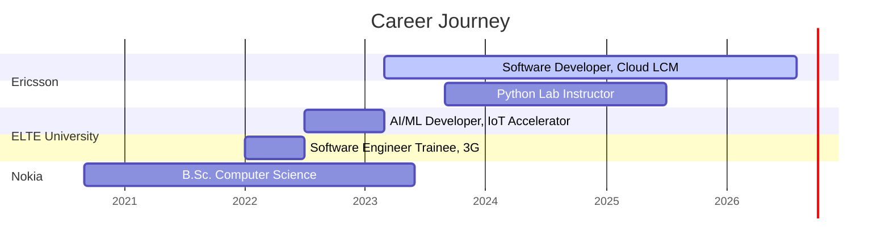

<div align="center">

<!-- Header Banner -->


<!-- Typing Animation -->


<br/>

<!-- Social Badges -->
[](https://amhkhowaja.github.io)
[](https://archloop.io)
[](https://linkedin.com/in/aadarsh-mehdi-73754b13b)
[](mailto:aadarshofficial110@gmail.com)

</div>

---


### About Me

 Currently at Ericsson Hungary

```yaml
name: Aadarsh Mehdi
role: Experienced Software Developer
company: Ericsson Hungary (Mar 2023 - Present)
education: B.Sc. Computer Science, ELTE Budapest
thesis: "Adaptive, Context-Aware AI Conversational Agent"
location: Budapest, Hungary
work_auth: Permanent Residence (no sponsorship)

side_roles:
  - Python Lab Instructor @ ELTE (Sep 2023 - Jul 2025)
  - Building Archloop.io, AI SaaS platform

interests:
  - Distributed systems at telecom scale
  - Multi-agent AI orchestration
  - Developer tooling & automation
```

<br clear="right"/>

---

### What I'm Working On

<table>
<tr>
<td width="50%" valign="top">

####  @  Ericsson
- Designing & operating **10+ microservices** on Kubernetes
- End-to-end ownership: API > tests > containers > prod
- Engineered **zero-data-loss migrations** (etcd > OpenSearch)
- Built shared libraries (auth, object_storage, search_engine)
- Reduced CI/CD test execution time by **40%**

</td>
<td width="50%" valign="top">

#### 
- **Archloop.io** : AI project management SaaS
- Multi-agent orchestration with LangGraph & CrewAI
- RAG pipelines & LLM evaluation (DeepEval)
- Self-optimizing prompt systems (AI Auto Improver)
- Previously: RASA Digital Assistant exhibited to customers

</td>
</tr>
</table>

---

### Tech Arsenal

<div align="center">

<!-- Languages -->


<br/><br/>

<!-- Cloud & Infra -->


<br/><br/>

<!-- Frameworks -->


<br/><br/>

<!-- Data & Tools -->


</div>

<details>
<summary><b>Full Skills Breakdown (click to expand)</b></summary>
<br/>

| Category | Technologies |
|----------|-------------|
| **Languages** | Python, Go, Java, Kotlin, C++, JavaScript, TypeScript, Bash, PowerShell |
| **Backend & Distributed** | Microservices, REST APIs, Event-Driven Architecture, Spring Boot, Kafka, RabbitMQ, OpenAPI |
| **Cloud & DevOps** | AWS (EC2, EKS, IAM, S3, Lambda, CloudWatch, SQS), GCP (GKE), Terraform, Kubernetes, Docker, Helm, Jenkins, Airflow, CI/CD |
| **AI / ML / GenAI** | LangChain, LangFlow, LangGraph, CrewAI, Instructor, LiteLLM, DeepEval, TensorFlow, Keras, RASA, RAG, Multi-Agent Orchestration |
| **Databases** | PostgreSQL, MongoDB, Redis, InfluxDB, ETCD, OpenSearch |
| **Observability & Security** | Prometheus, Grafana, VictoriaMetrics, OAuth 2.0, RBAC, Keycloak, SCA, SonarQube |
| **Frontend** | React, Streamlit, Gradio, HTML, CSS, Bootstrap |
| **Testing** | Robot Framework, Selenium, pytest, JUnit, testify (Go) |
| **Collaboration** | Git, GitHub, GitLab, Gerrit, Jira, Confluence |

</details>

---

### GitHub Stats

<div align="center">


</div>

<br/>

<div align="center">

</div>

---

### Featured Projects

<div align="center">

[](https://archloop.io)

</div>

| | Project | Description | Stack |
|---|---------|-------------|-------|
|  | [**Archloop.io**](https://archloop.io) | AI-powered SaaS for project management. Multi-tenant, Jira/GitHub/GitLab integration, agentic AI orchestration | FastAPI, React, Keycloak, LangChain, Temporal, Stripe, Supabase |
|  | [**AI Auto Improver**](https://github.com/amhkhowaja/ai-auto-improvement) | Self-optimizing prompt evolution with pairwise regression gates & multi-dimensional evaluation | FastAPI, LiteLLM, Instructor, Gradio, Docker |
|  | [**AWS ETL Pipeline**](https://github.com/amhkhowaja/aws-terraform-serverless-etl-pipeline) | Serverless ML pipeline for car sales prediction with IaC | AWS Lambda, S3, SQS, Terraform, sklearn |
|  | [**Pay-as-you-go**](https://github.com/amhkhowaja/Pay-as-you-go) | Microservices billing platform with multi-tenant auth | Kotlin, Spring Boot, Stripe, Keycloak, RabbitMQ |
|  | [**IoT Digital Assistant**](https://github.com/amhkhowaja/IoT-Digital-Assistant) | NLP conversational agent for IoT, exhibited at Ericsson Innovation Day | RASA, TensorFlow, Airflow, GCP |
|  | [**WebCrawler**](https://github.com/amhkhowaja/WebCrawler) | Recursive site crawler with JS rendering support | Python, Playwright |
|  | **Multi-Agent Config System** | LangFlow agents generating & validating config changes across releases | LangFlow, Multi-Agent, K8s |
|  | **Autonomous AI SE Platform** | Pipeline-driven platform: prompt > develop > test > containerize > deploy to K8s | AI, Docker, K8s, CI/CD |

---

### Achievements

<div align="center">

|  |  |  |
|:---:|:---:|:---:|
| **Ericsson Innovation Day** | **Google HashCode** | **CodeX Hackathon** |
| Exhibited AI Digital Assistant to external customers | 1st at ELTE, 20th in Hungary | Audience Award |

</div>

---

### Career Timeline



---

### Contribution Snake

<div align="center">


</div>

---

<div align="center">


<br/><br/>

```
 ┌──────────────────────────────────────────────────────────┐
 │  "Ship it, observe it, improve it, then automate it."    │
 └──────────────────────────────────────────────────────────┘
```

<!-- Footer Wave -->


</div>
